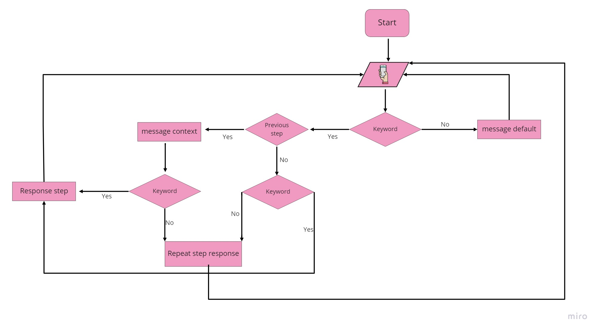
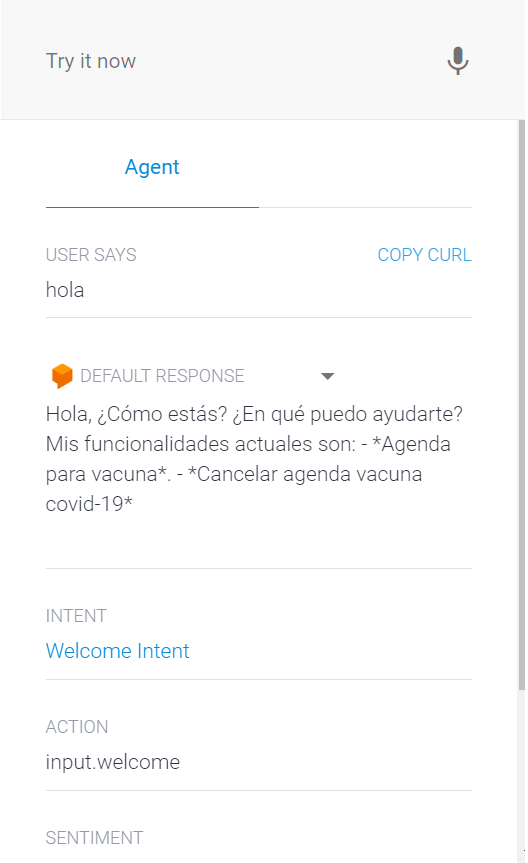
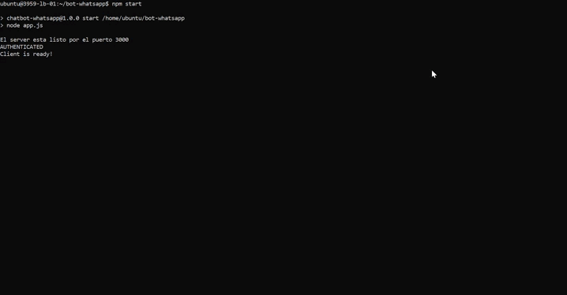

#   Whatsapp Chatbot

The chatbot has two functions so far, one to schedule and another to cancel the schedule.
In addition to responding automatically following a conversation flow, it saves all the messages received in the different interactions, both in the MongoDB database and in a JSON file with the cell phone number with which the user is contacted.

## Tecnologies

## How to use it

- First clone this repository.
- Rename the file .env.config to .env and select the flow option to use `none = json` or `dialogflow`(default)
- If you are going to use a self-created dialogflow, you must put the access keys in the chatbot-account.json file. Watch this video: https://www.youtube.com/watch?v=dFN79tEr_bc&ab_channel=RajKapadia
- If you are going to use Mongodb Atlas for saving the messages, you must put your password and database name in mongoose.connect line 52 app.js file. And uncomment line 97 `(saveMongo(number, message);)`                                                                                                             
Watch this blog: https://hevodata.com/learn/mongodb-atlas-nodejs/
- If you don´t have nodejs install you should run the following steps:
    - Download and install Nodejs for you Operating System https://nodejs.org/en/download/
    - Install dependencies (libraries needed to run the application, you can see them in package.json file) -> `npm install`
- run `npm start`
- The first time, scan qr code on console or http://localhost:3000/qr
- Wait for the messages 
- If you have two mobiles, you can send a messages and test the responses.
- `CTR + C` to end the execution of the program

## File description

File | Description |
---- | ----------- | 
[app.js](./app.js) | Core of the program, create user session, manage the flow
[.env.config](./env.config) | Enviroment configuration
[chatbot-account.json](./chatbot-account.json) | Keys to connect with dialogflow
[dialogflow.js](./adapter/dialogflow.js) | manage the dialogflow connection
[index.js](./adapter/index.js) | Data management and the different stages
[jsonDn.js](./adapter/jsonDb.js) | Saving messages in json file
[agendar.js](./controllers/agendar.js/) | Some stages of the agenda adn email validator
[handle.js](./controllers/handle.js) | Clean phone number extension and generate qr image
[searchLast.js](./controllers/searchLast.js/) | Search the last message in json file
[send.js](./controllers/send.js/) | Send the messages
[web.js](./controllers/web.js) | Show the qrcode on localhost:3000
[initialflow.json](./flow/initialflow.json/) | Keywords and keys for the different stages
[response.json](./flow/response.json) | Text for reply messages

## Flowchart

## Caputures and videos 

### Welcome chatbot

### Running whatsapp chatbot

### Consola chatbot

### Dialogflow

## Sources
- https://github.com/pedroslopez/whatsapp-web.js
- https://www.npmjs.com/
- https://wwebjs.dev/guide/
- https://www.w3schools.com/js/default.asp
- https://www.geeksforgeeks.org/javascript/?ref=lbp
- https://www.geeksforgeeks.org/nodejs/?ref=lbp
- https://www.youtube.com/watch?v=lf_oFEqxxbs&list=PL_wRgp7nihyYdnV6ilQcZsfdG5d2nGWkc&ab_channel=UskoKruM2010
- https://dev.to/emmanuelthecoder/tutorial-create-a-whatsapp-bot-using-nodejs-and-puppeteer-1fn7
- https://www.youtube.com/watch?v=dFN79tEr_bc&ab_channel=RajKapadia

## Next steps 
- Add more functions: weather api, translate api, etc. 
- Add more channels: Facebook, Slack.

## AUTHOR
[**Matias López**](https://www.linkedin.com/in/matiaas-lopez/)
